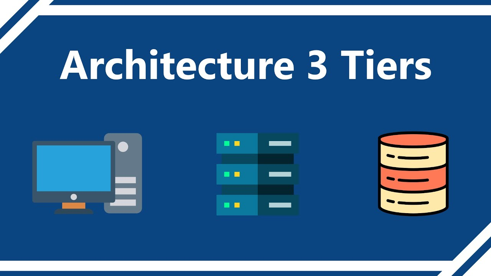

# Fullstack3Tiers
# Déploiement d'une application 3 tiers avec Docker Compose

Ce projet met en place une architecture complète avec un frontend, un backend (WordPress), une base de données (MySQL), un reverse proxy (Traefik), et un outil de monitoring (Netdata).
 
---

## Outils utilisés

- **Docker** : Conteneurisation des services
- **Docker Compose** : Orchestration des conteneurs
- **Traefik v3** : Reverse proxy dynamique et dashboard
- **WordPress** : CMS utilisé comme backend
- **MySQL 8** : Base de données relationnelle
- **Netdata** : Monitoring des services

---

## Structure des services

- `frontend` : Interface utilisateur
- `backend` : WordPress + PHP
- `base_donnee` : MySQL 8 avec volume persistant
- `traefik` : Reverse proxy pour router les services avec des noms de domaine locaux
- `netdata` : Outil de monitoring en temps réel

---

## Installation et lancement

### 1. Cloner le dépôt

```bash
git clone https://github.com/votre-utilisateur/votre-projet.git
cd votre-projet/preprod
```

### 2. Construire les images (frontend)  

# à develloper avec des plus des détails
```bash
docker compose build
```

### 3. Lancer l'application

```bash
docker compose up -d
```

---

## Accès aux services

### Ajoutez ces lignes dans votre fichier `hosts` :

Sous Linux/macOS :
```bash
sudo nano /etc/hosts
```

Sous Windows :
```txt
C:\Windows\System32\drivers\etc\hosts
```

À ajouter :
```
127.0.0.1 frontend.preprod.local
127.0.0.1 backend.preprod.local
127.0.0.1 netdata.local
```

### Services disponibles

| Service            | URL                                     |
|--------------------|-----------------------------------------|
| Frontend           | http://frontend.preprod.local           |
| Backend (WordPress)| http://backend.preprod.local            |
| Traefik Dashboard  | http://localhost:8080                   |
| Netdata Monitoring | http://localhost:19999                  |

---

## Dépannage

### Le conteneur MySQL ne démarre pas

**Symptôme :**
```bash
STATUS: Exited (1)
```

**Cause possible :**
Tu as déjà un volume MySQL d'une version précédente (ex : MySQL 5.7) qui bloque la montée en version vers MySQL 8.

**Solution :**
Si tu es en environnement de test :

```bash
docker compose down -v
docker compose up -d
```

>  Attention : cela efface les données de la base de données.

---

###  Le nom de domaine local ne fonctionne pas (`.local`)

**Solution :**
Assure-toi que les entrées suivantes sont bien ajoutées dans le fichier `hosts` :

```
127.0.0.1 frontend.preprod.local
127.0.0.1 backend.preprod.local
127.0.0.1 netdata.local
```

Et que Traefik est bien exposé sur le port 80 (via `ports:` dans `docker-compose.yml`).

---

###  Je veux réinitialiser tous les conteneurs

```bash
docker compose down -v --remove-orphans
docker compose build --no-cache
docker compose up -d
```


